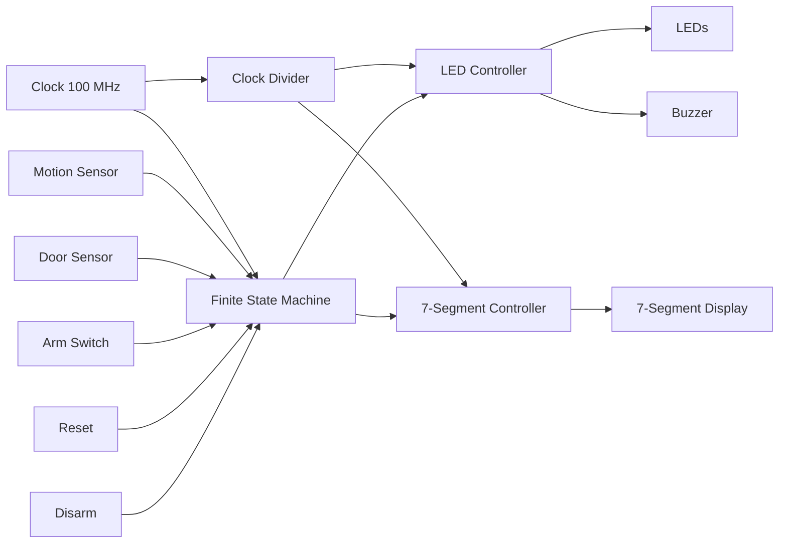

# 🏠 Smart Home Surveillance Controller using Verilog HDL on Nexys A7 FPGA

A hardware-based smart home surveillance system implemented in **Verilog HDL** on the **Nexys A7 FPGA**. The project uses a **Finite State Machine (FSM)** to monitor motion and door sensor inputs, detect intrusion scenarios, and provide real-time visual and audio alerts through LEDs, a buzzer, and a seven-segment display.

The system follows a modular hardware design consisting of dedicated modules for clock division, state management, LED control, and seven-segment display control. The design was verified through behavioral simulation in **Vivado** and successfully implemented on the **Nexys A7 FPGA board**, demonstrating reliable operation under multiple security scenarios.

## ✨ Features

1. 🔄 Four-state Finite State Machine (FSM) based surveillance controller
2. 🚪 Motion detection and door intrusion monitoring
3. 🚨 Automatic alarm escalation for intrusion scenarios
4. 🔴 Real-time LED status indicators
5. 📟 Seven-segment display for system state visualization
6. 🔊 Buzzer output for alarm indication
7. ⏱️ Clock divider for 1 Hz alarm blinking and 1 kHz display multiplexing
8. 🧩 Modular Verilog HDL design for easy maintenance and scalability
9. ✅ Behavioral simulation and FPGA hardware validation

## 🛠️ Hardware & Software

### Hardware
1. Nexys A7 FPGA Board (Artix-7 XC7A100T)
2. On-board LEDs
3. Push Buttons
4. Slide Switches
5. Four-Digit Seven Segment Display
6. Pmod Buzzer

### Software
1. Verilog HDL
2. Xilinx Vivado Design Suite 2025.1

## 🏗️ System Architecture

## ⚙️ System Workflow

1. The FPGA continuously monitors the **Arm**, **Motion**, and **Door** input signals.
2. The **Finite State Machine (FSM)** processes these inputs and determines the current surveillance state.
3. The **Clock Divider** generates lower-frequency clocks for LED blinking and seven-segment display multiplexing.
4. The **LED Controller** activates the corresponding LEDs and buzzer based on the FSM state.
5. The **Seven-Segment Controller** displays the current system status in real time.
6. The system remains in the **Alarm** state until a **Reset** or **Disarm** signal is received.

## 📦 Module Description

| Module | Description |
|---------|-------------|
| `top_level.v` | Integrates all hardware modules and connects FPGA inputs and outputs. |
| `fsm.v` | Implements the four-state Finite State Machine that controls surveillance logic. |
| `clk_divider.v` | Generates lower-frequency clocks for alarm blinking and seven-segment display multiplexing. |
| `led_controller.v` | Controls LEDs and buzzer according to the current surveillance state. |
| `seg7_controller.v` | Displays the current system status on the four-digit seven-segment display. |
| `nexys_a7.xdc` | Maps FPGA I/O pins to switches, LEDs, buttons, buzzer, and display. |
| `top_level_tb.v` | Testbench used for behavioral simulation and verification. |
